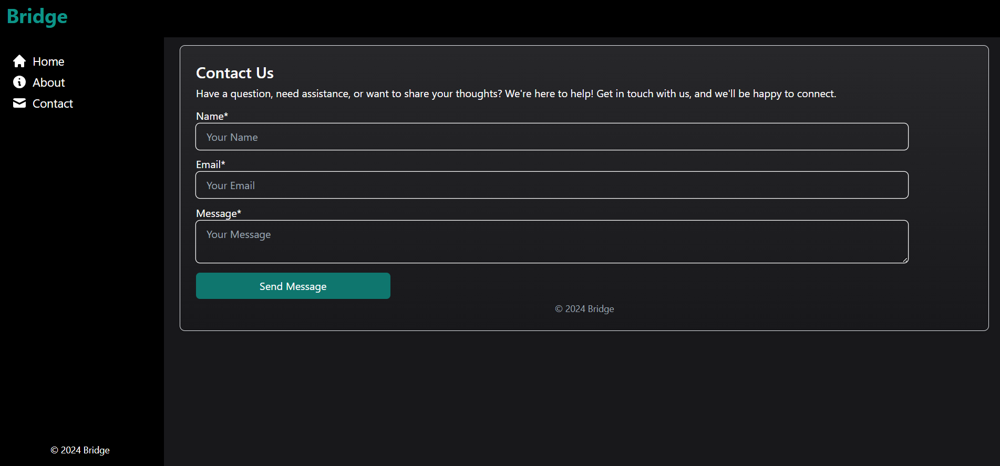

# Bridge

## Description

### Responsive Web App

'Bridge' is a responsive web application that allows users to swap cryptocurrency tokens across different blockchains. It leverages the XY Finance API to provide quotes for token exchanges and facilitates transactions seamlessly.

## Technology Used

### Frontend
- React Native
- Next.js
- Tailwind CSS
- Chakra UI

### Backend
- Node.js
- Express.js
- Firebase
- XY Finance API

## Screenshots of Working

### HomePage

**Home**

| Desktop View | Mobile View |
|--------------|-------------|
|  |  |

**Tokens Selection**

| Desktop View | Mobile View |
|--------------|-------------|
|  |  |

### Quote

| Desktop View | Mobile View |
|--------------|-------------|
|  |  |

### Transaction Page

**Successful Transaction**


### About Page

**About Section**


### Contact Page

**Contact Page**



### Sidebar Mobile View

**Mobile Sidebar**


## How to Run

### Frontend

1. Clone the repository:
    ```bash
    git clone https://github.com/yourusername/bridge-frontend.git
    ```
2. Navigate to the project directory:
    ```bash
    cd bridge-frontend
    ```
3. Install dependencies:
    ```bash
    npm install
    ```
4. Create a `.env.local` file from `.env.example`:
    ```bash
    cp .env.example .env.local
    ```
5. Start the development server:
    ```bash
    npm run dev
    ```

### Backend

1. Clone the repository:
    ```bash
    git clone https://github.com/yourusername/bridge-backend.git
    ```
2. Navigate to the project directory:
    ```bash
    cd bridge-backend
    ```
3. Install dependencies:
    ```bash
    npm install
    ```
4. Create a `.env` file from `.env.example`:
    ```bash
    cp .env.example .env
    ```
5. Start the server:
    ```bash
    npm start
    ```

## Credit

@FadeHack
