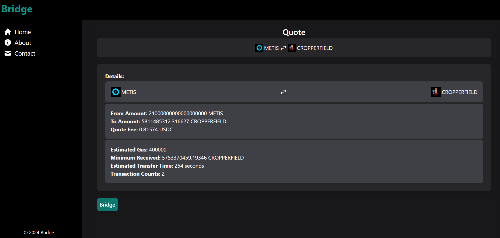

# Bridge

## Description

### Responsive Web App

'Bridge' is a responsive web application that allows users to swap cryptocurrency tokens across different blockchains. It leverages the XY Finance API to provide quotes for token exchanges and facilitates transactions seamlessly.

## Technology Used

### Frontend
- React Native
- Next.js
- Tailwind CSS
- Chakra UI

### Backend
- Node.js
- Express.js
- Firebase
- XY Finance API


### Screenshots of Working

#### HomePage

**Home**

<div class="image-container">
  
  
</div>

<style>
  .image-container {
    display: flex; 
    justify-content: space-around; 
    align-items: center; 
  }

  .image-container img {
    max-width: 50%; 
  }
</style>

**Tokens Selection**

<div class="image-container">
  
  
</div>

#### Quote

<div class="image-container">
  
  
</div>

#### Transaction Page


#### About Page


#### Contact Page


#### Sidebar Mobile View


## How to Run

### Frontend

1. Clone the repository:
    ```bash
    git clone https://github.com/yourusername/bridge-frontend.git
    ```
2. Navigate to the project directory:
    ```bash
    cd bridge-frontend
    ```
3. Install dependencies:
    ```bash
    npm install
    ```
4. Create a `.env.local` file from `.env.example`:
    ```bash
    cp .env.example .env.local
    ```
5. Start the development server:
    ```bash
    npm run dev
    ```

### Backend

1. Clone the repository:
    ```bash
    git clone https://github.com/yourusername/bridge-backend.git
    ```
2. Navigate to the project directory:
    ```bash
    cd bridge-backend
    ```
3. Install dependencies:
    ```bash
    npm install
    ```
4. Create a `.env` file from `.env.example`:
    ```bash
    cp .env.example .env
    ```
5. Start the server:
    ```bash
    npm start
    ```

## Credit

@FadeHack


<style>
  .image-container {
    display: flex; /* Enable flexbox layout */
    justify-content: space-around; /* Space images evenly */
    align-items: center; /* Vertically center images */
  }

  .image-container img {
    max-width: 50%; /* Set maximum width for images */
  }
</style>